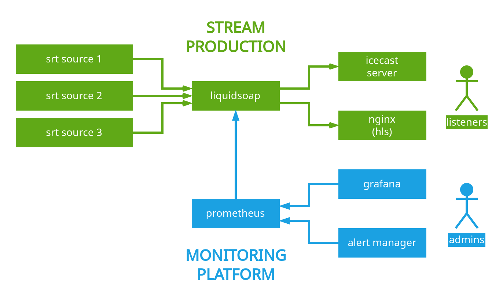
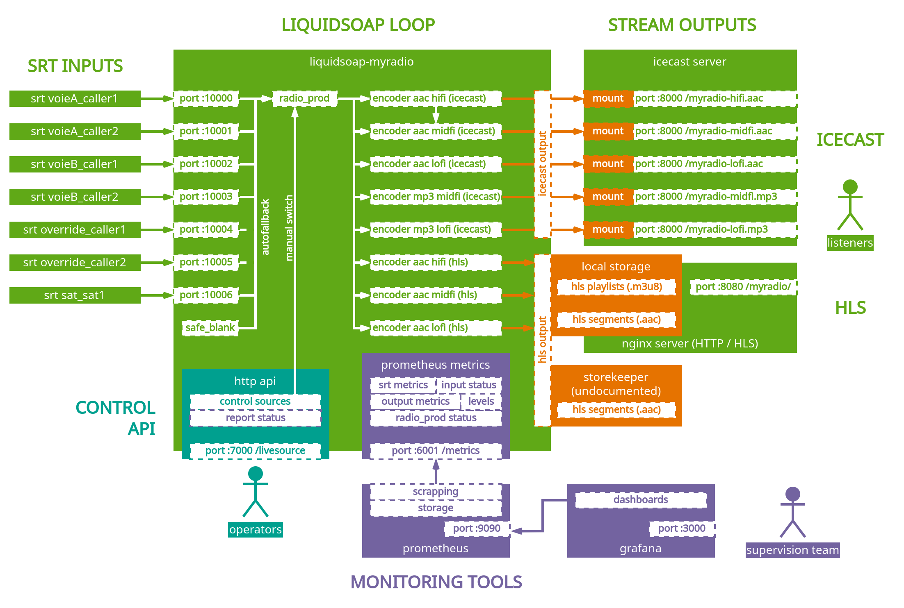
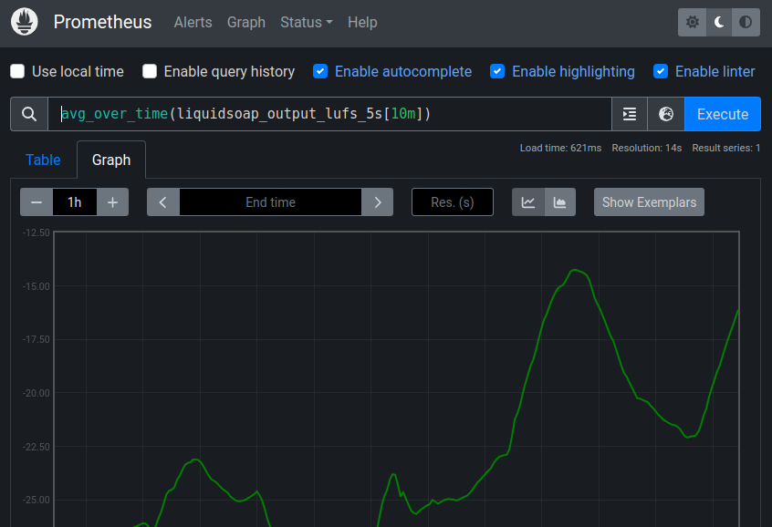
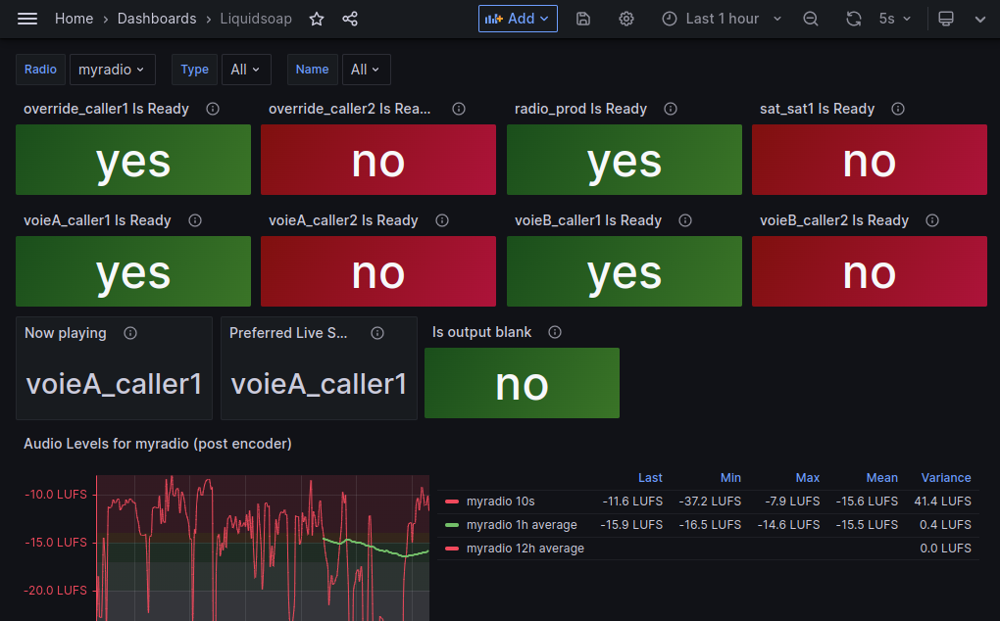
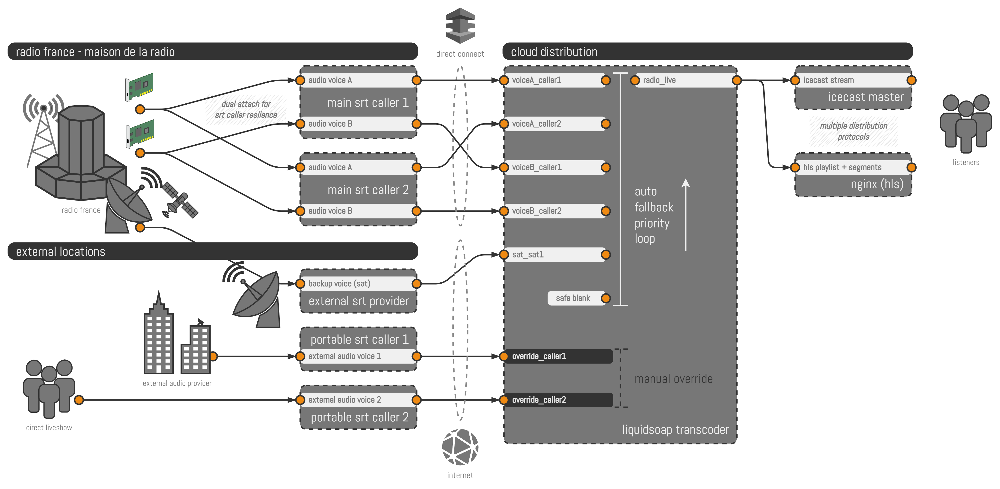

# Radio France's Liquidsoap scripts

[](https://radiofrance.fr)
[](https://radiofrance.com)
[](https://github.com/radiofrance/rf-liquidsoap/stargazers)

<p align="center">
  
</p>
<p align="center">
  [<a href="CHANGELOG.md">CHANGELOG</a> -
   <a href="#license">LICENSE</a>]
</p>

This project contains the [Liquidsoap](https://www.Liquidsoap.info/) scripts
used at [Radio France](https://radiofrance.fr) in production to produce
multi-sourced resilient [HLS](https://developer.apple.com/streaming/) and
[Icecast](https://icecast.org/) streams for our 77 radio stations.

It includes a demo monitoring stack for metrics, alerts and dashboards, based on
[Prometheus](https://prometheus.io/),
[Alertmanager](https://prometheus.io/docs/alerting/latest/alertmanager/) and
[Grafana](https://grafana.com/). This stack is a simplified version of the one
we use in our production environments.

An example station implementation called `myradio` is provided, using other
online radios as SRT sources. At Radio France, those SRT sources are coming from
our studios. Each Liquidsoap process (supposedly one per station) is fed
multiple times with the same audio content coming from different network paths,
which allows us to be resilient and to perform maintenances without service
interruptions.

If you want to know more about our streaming infrastructure:

- [FOSDEM (2020)](https://archive.fosdem.org/2020/schedule/event/om_audio_streaming/) ([Maxime Bugeia](https://github.com/mbugeia))
- [Liquidshop 1.0 (2021)](http://www.Liquidsoap.info/liquidshop/1/) ([Youenn Piolet](https://github.com/uZer)) - [video](https://www.youtube.com/watch?v=UnHfgDmi9_w) - [slides](http://www.Liquidsoap.info/liquidshop/1/slides/piolet.pdf)
- [Liquidshop 3.0 (2023)](http://www.Liquidsoap.info/liquidshop/3/) ([Youenn Piolet](https://github.com/uZer)) - [video](https://www.youtube.com/watch?v=Lyj4YLj2evY) - [slides](https://github.com/radiofrance/rf-liquidsoap/blob/d62f08a5de7c7521c96d3af357fa4de465a55c02/.res/2023-05-30.liquidshop3.presentation.md?plain=1#L2) `slides .res/2023-05-30.liquidshop3.presentation.md`

## Design



For each station (sometimes called "radio" in this repository), a Liquidsoap
process will consume a set of active/fallback SRT sources to produce a single
output stream called `radio_prod`. In the eventuallity the current preferred SRT
source should fail, `radio_prod` will fallback to the next available source.
Some sources can be excluded from the autofallback loop, waiting for a manual
switch.

The output stream `radio_prod` is encoded multiple times with different encoders
and with multiple quality profiles. We provide some encoder settings as
"profiles" in the [common Liquidsoap script](scripts/formats/) (mp3, aac,
libfdk-aac...).

After the encoding, there are two output methods running in parallel:

- Icecast: Liquidsoap connects as a source to an icecast server and pushes audio

- HLS: adaptative / rolling playlists and audio segments are created locally and
  can be served by a simple HTTP server like NGINX. There is a purge mechanism
  that will get rid of old audio segments. Segments can also be pushed
  on a remote service we called `segmentforwarder`. Please note that this custom
  external service is not provided in this repository, but we can tell you it
  allows us to index those segments, build our HLS playlists, timeshift and push
  the segments to CDN providers.

In this project, the Liquidsoap configuration files are split in two. This
separation allows us to industrialize the station definitions:

- The `scripts/` folder contains a common set of Liquidsoap scripts that are
  reused for each station. You may see it as a versionned "template folder" or
  "app". When we bring changes to these configuration files, all of our streams
  are impacted.

- Per station configuration is achieved in a another file, provided in the
  [start command](docker-compose.yml#L20) of the Liquidsoap process: for each
  stream we build, the `autofallback` SRT inputs, listening ports and output
  formats are defined in their own standalone file (see
  [myradio.liq](example/liquidsoap/myradio.liq) for a complete example). You
  can see this as an inventory file. (To be honnest, we have so many stations to
  define we actually generate those files with an external templating tool)

In the common Liquidsoap configuration, [Prometheus](scripts/20-prometheus.liq)
metrics are created and exposed on a dedicated port, allowing the real time
monitoring of buffers, audio levels and SRT input state.



## Getting started

### Requirements

Everything will run in containers so you don't need much:

- `make`
- `docker`
- a player, like `vlc`, `ffplay` or a browser
- `curl` to make calls to the HTTP API

### Start containers

```bash
make help
make start
```

You can safely press `ctrl+c` to stop displaying logs

### Checking service state

```
make status
make logs
```

### Cleanup

This stack is portable and can be stopped and removed with:

```
make clean
```

### Listening

By default, the Liquidsoap main loop produces blank audio when nothing is fed
into the SRT input ports. It means that if Liquidsoap is started, you can
already listen to the blank stream using the Icecast URL or the HLS playlist.

If you ran the complete stack with the `make start` command, 3 SRT sources will
feed the Liquidsoap service, coming from various Internet Radios you will
restream locally: `voieA_caller1`, `voieB_caller1` and `override_caller1`

First SRT input `voieA_caller1` will be selected by default.

In the following examples we use `ffplay` as the audio player, but you could use
anything you want: a custom web player, a mobile app, `vlc`, a native player
inside a browser, etc.

Listening URLs for the `myradio` example are the following:

#### HLS

To listen to the [HLS](https://datatracker.ietf.org/doc/html/rfc8216) adaptative
playlist:

```bash
ffplay http://127.0.0.1:8080/myradio/myradio.m3u8
# Use letter 'c' in the ffplay window to switch between playlists.
# Default playlist order with ffplay: lofi, midfi, hifi. You may experience a
# different order according to your player.
```

For convenience, playlists and HLS `.ts` segments can be browsed thanks to the
nginx server:

```
chrome http://127.0.0.1:8080/
```

#### Icecast

```bash
# AAC
## high quality
ffplay http://127.0.0.1:8000/myradio-hifi.aac

## mid quality
ffplay http://127.0.0.1:8000/myradio-midfi.aac

## low quality
ffplay http://127.0.0.1:8000/myradio-lofi.aac

# MP3
## mid quality
ffplay http://127.0.0.1:8000/myradio-midfi.mp3

## low quality
ffplay http://127.0.0.1:8000/myradio-lofi.mp3
```

### Using HTTP API

The HTTP API allows you to switch between sources or get information about the
output stream.

You can easily get current status:

```
$ curl -s 127.0.0.1:7000/livesource
```

You will get the following response:

```
{
  "preferred_output": "voieA_caller1",
  "inputs": [
    "voieA_caller1",
    "voieA_caller2",
    "voieB_caller1",
    "voieB_caller2",
    "override_caller1",
    "override_caller2",
    "sat_sat1"
  ],
  "real_output": "safe_blank",
  "is_output_blank": true
}
```

`preferred_output` is the preferred SRT source that Liquidsoap will select to
build the output stream (highest priority input).

`real_output` is the real source currently used by Liquidsoap to build the
output stream. If the preferred livesource is unavailable, you can read here
which source Liquidsoap is currently using as a fallback.

`is_output_blank` is a boolean set to true when audio is blank (no sound).

To manually switch between SRT sources:

```
$ curl -s -d <input> http://127.0.0.1:7000/livesource
```

For example:

```
$ curl -s -d override_caller1 http://127.0.0.1:7000/livesource
{"preferred_output": "override_caller1"}
```

### Show default exposed URLs and useful ports

```
make info
```

### Sending audio to the streaming server with SRT

To send audio to the SRT source, you can use
[srt-live-transmit](https://github.com/Haivision/srt/blob/master/docs/apps/srt-live-transmit.md)
or `ffmpeg` compiled with [SRT](https://github.com/Haivision/srt) support
(Debian Bullseye `ffmpeg` or https://johnvansickle.com/ffmpeg/ for example).

We provide examples in the containers prefixed with `source-`. By default, they
will start with `make start` but you can replace them by something more suitable
for your needs.

You can also feed the SRT sources manually:

```bash
# static file
ffmpeg -re -i $AUDIOFILE -vn -f wav -codec:a pcm_s16le srt://127.0.0.1:10001

# live stream
export LIVESTREAM='https://stream.radiofrance.fr/fip/fip_hifi.m3u8?id=Liquidsoap'
ffmpeg -re -i $LIVESTREAM -vn -f wav -codec:a pcm_s16le srt://127.0.0.1:10001
```

The port `:10001` should be modified to match the SRT input you want to use.
Each SRT input in the fallback loop has its own port. See
[`input_list`](example/liquidsoap/myradio.liq#L9) to find port definitions.

## Monitoring

Multiple endpoints are provided for the supervision of the stack. Most of them
are based on the following prometheus metrics, created in the Liquidsoap
scripts.

### Exported Prometheus metrics in the Liquidsoap script

| Name                                        | Type    | Description                            |
|-------------------------------------------- | ------- | -------------------------------------- |
| liquidsoap_hlssegment_sent                  | counter | Number of HLS segment send to segment-forwarder |
| liquidsoap_input_latency_seconds            | gauge   | Mean input latency over the chosen window |
| liquidsoap_input_max_latency_seconds        | gauge   | Max input latency since start |
| liquidsoap_input_peak_latency_seconds       | gauge   | Peak input latency over the chosen window |
| liquidsoap_output_latency_seconds           | gauge   | Mean output latency over the chosen window |
| liquidsoap_output_lufs_5s                   | gauge   | Audio LUFS Analysis of radio_prod with 5s windows |
| liquidsoap_output_max_latency_seconds       | gauge   | Max output latency since start |
| liquidsoap_output_peak_latency_seconds      | gauge   | Peak output latency over the chosen window |
| liquidsoap_overall_latency_seconds          | gauge   | Mean overall latency over the chosen window |
| liquidsoap_overall_max_latency_seconds      | gauge   | Max overall latency since start |
| liquidsoap_overall_peak_latency_seconds     | gauge   | Peak overall latency over the chosen window |
| liquidsoap_source_is_blank                  | gauge   | Is source blank? (no audio) |
| liquidsoap_source_is_playing                | gauge   | Is source playing? |
| liquidsoap_source_is_preferred_livesource   | gauge   | Is source the preferred livesource? |
| liquidsoap_source_is_ready                  | gauge   | Is source ready? |
| liquidsoap_source_unready_duration_seconds  | counter | Cumulative duration in seconds of the source in unready state |
| liquidsoap_srt_input_buffer_length          | gauge   | Length of the SRT buffer |
| liquidsoap_srt_input_bytes_available        | gauge   | SRT stat byteAvailRcvBuf |
| liquidsoap_srt_input_packet_drop_total      | gauge   | SRT stat pktRcvDropTotal (cumulative) |
| liquidsoap_srt_input_packet_loss_total      | gauge   | SRT stat pktRcvLossTotal (cumulative) |
| liquidsoap_srt_input_packet_received_buffer | gauge   | SRT stat pktRcvBuf |
| liquidsoap_srt_input_packet_received_total  | gauge   | SRT stat pktRecvTotal (cumulative) |
| liquidsoap_time_of_last_data_timestamp      | gauge   | Last time source produced some data. |

### Prometheus metric exploration

You can explore scrapped metrics and generate basic graphs from the Prometheus
web interface:

`http://127.0.0.1:9090/graph`



Learn more about the request syntax on [Prometheus
website](https://prometheus.io/docs/prometheus/latest/querying/basics/)

You can check Prometheus metric scrapping status in the web interface too:

`http://127.0.0.1:9090/targets`

### Grafana

If you want to save the dashboards you created in Prometheus or to benefit
from better visualization tools, you can use Grafana to browse, edit and save
advanced dashboards.

`http://127.0.0.1:3000/dashboards`

You can get the default credentials from the
[`docker-compose.yml`](docker-compose.yml#L142). After your first login, Grafana
may ask you to change those credentials. We provided some example dashboards
similar to the ones we use at Radio France, they can be modified in
[`example/grafana/provisioning/dashboards`](example/grafana/provisioning/dashboards/)



### Alertmanager

[Alertmanager](https://prometheus.io/docs/alerting/latest/alertmanager/) is here
to handle alerts defined in Prometheus. An example container can be found in the
`docker-compose.yml` file.

## Our architecture



Our Liquidsoap infrastructure and usage are documented in the video
presentations and slides at the top of this document.

You can read more about us here:

- [AMA Reddit (fr)](https://www.reddit.com/r/france/comments/fsvgfu/ama_nous_sommes_les_%C3%A9quipes_techniques_du/)
- [Open Source Observatory (European Commission)](https://joinup.ec.europa.eu/collection/open-source-observatory-osor/news/close-collaboration)
- [Xuanta de Galicia (es)](https://www.mancomun.gal/noticias/radio-france-contribue-con-software-de-codigo-aberto/)

## Authors, acknowledgements

This repository is maintained by Radio France.

Fondation Team, Direction du Numérique, 2020-now

Many thanks to Romain Beauxis, Samuel Mimram, the awesome Liquidsoap community,
contributers and open source radio broadcasters that allowed a national
broadcaster like Radio France to build its streaming platform with open source
tools.

[Greetings](/GREETINGS.md) to all current and past members from the Fondation
Team. Special thanks to Maxime Bugeia for his precious work on this project.

## Contributions and questions

Feel free to fork or open issues if you have questions.

Pull requests are welcome, but be aware we will be extra carreful in the merge
process since it has to match our needs.

## License

The `rf-liquidsoap` project is released under the CeCILL-B
([en](/Licence_CeCILL-B_V1-en.txt), [fr](/Licence_CeCILL-B_V1-fr.txt)) license.

https://cecill.info/
